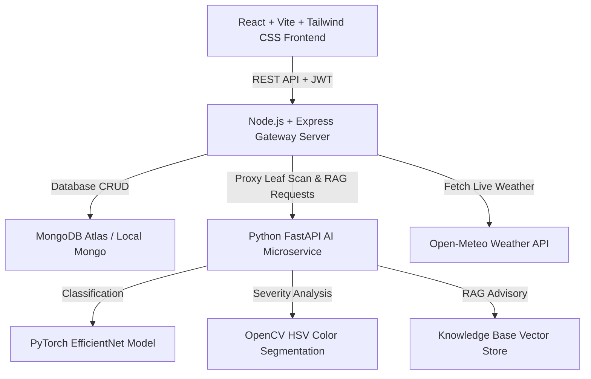

# AgriPulse AI: An AI-Powered Precision Agriculture and Crop Disease Advisory System


---

## 📌 Abstract

Agriculture is highly vulnerable to crop diseases and changing weather conditions, which can significantly affect crop productivity and farmers' income. **AgriPulse AI** is an intelligent precision agriculture and crop disease advisory platform combining **Computer Vision (EfficientNet)**, **OpenCV Severity Estimation**, **Retrieval-Augmented Generation (RAG)**, **Real-Time Weather Integration**, and **Multilingual (English & Malayalam) Text/Voice Assistance**.

Farmers can upload images of affected plant leaves through a web application. The deep learning model identifies probable diseases with a confidence score, while OpenCV estimates the affected leaf area percentage. The RAG advisory engine retrieves verified guidelines from agricultural institutions (such as KAU/ICAR) and incorporates live weather data (temperature, humidity, rain probability, wind) to generate weather-aware, responsible crop management advice.

---

## ✨ Key Features

- 🌿 **Leaf Image Disease Diagnosis**: Fast deep learning inference classifying common crop diseases (Tomato, Paddy, Potato, Corn, Chilli, etc.) with confidence scores.
- 📐 **OpenCV Lesion Severity Estimation**: Uses HSV color segmentation and contour analysis to calculate exact leaf surface area affected (Mild <15%, Moderate 15-40%, Severe >40%).
- 📚 **RAG-Based Advisory Engine**: Contextual recommendations detailing **Organic/Biological remedies**, **Chemical interventions**, and **Preventive practices** with authoritative source citations.
- 🌦️ **Weather-Aware Spray Safety Check**: Live weather fetching via Open-Meteo API. Automatically warns farmers if high rain probability or wind speed makes chemical spraying unsafe.
- 🗣️ **Multilingual & Voice Assistance**: Full UI & Advisory support in both **English and Malayalam (മലയാളം)** with one-click **Text-to-Speech audio read-aloud**.
- 📍 **Farm Plot & History Management**: Farmers can register multiple plots, attach crop scans, and monitor crop health trajectories over time.
- 📊 **Admin Dashboard**: System analytics, disease prevalence pie charts, monthly scan trend graphs (built with Recharts), user directory, and Knowledge Base management.

---

## 🏗️ System Architecture



---

## 🛠️ Technology Stack

| Layer | Technology |
|---|---|
| **Frontend** | React 18, Vite, Tailwind CSS, Lucide React, Recharts, Web Speech API |
| **Backend** | Node.js, Express.js, MongoDB / Mongoose, JWT Authentication, Multer |
| **AI Microservice** | Python 3.x, FastAPI, Uvicorn, PyTorch / Torchvision, OpenCV, PIL, NumPy |
| **RAG Knowledge Base** | Vector Similarity Retrieval, Curated KAU/ICAR Agricultural Guidelines |
| **External APIs** | Open-Meteo Global Weather API (Free, keyless integration) |

---

## 📁 Repository Structure

```
AgriPulse/
├── package.json                   # Workspace scripts for root concurrency
├── README.md                      # Project Documentation
├── server/                        # Express API Gateway & MongoDB Models
│   ├── server.js                  # Entry point
│   ├── package.json
│   ├── .env                       # Environment configuration
│   ├── models/                    # User, Plot, Diagnosis, KnowledgeBase schemas
│   ├── routes/                    # Auth, Plot, Diagnosis, Weather, Admin APIs
│   └── middleware/                # JWT Auth & Admin authorization
├── ai_service/                    # Python FastAPI AI & RAG Microservice
│   ├── main.py                    # FastAPI app entry
│   ├── disease_classifier.py      # PyTorch disease classification pipeline
│   ├── severity_analyzer.py       # OpenCV leaf lesion area calculator
│   ├── rag_engine.py              # Knowledge retrieval engine (EN & Malayalam)
│   ├── knowledge_data.json        # Curated agricultural remedies & citations
│   └── requirements.txt           # Python dependencies
└── client/                        # React Vite Web Frontend
    ├── index.html
    ├── vite.config.js
    ├── tailwind.config.js
    ├── package.json
    └── src/
        ├── App.jsx                # Main Router & Route Guards
        ├── context/               # AuthContext & LanguageContext (EN/ML + TTS)
        ├── components/            # Navbar, Footer, WeatherWidget
        └── pages/                 # HomePage, Dashboard, Diagnosis, Plots, History, Admin
```

---

## 🚀 Quick Start Guide

### Prerequisites
- **Node.js**: v18.x or higher
- **Python**: 3.10 or higher
- **MongoDB**: Local MongoDB or MongoDB Atlas URI

### 1. Clone & Set Up Workspace
```bash
git clone https://github.com/Athul3588krishna/AgriPulse.git
cd AgriPulse
```

### 2. Set Up Express Backend (`server/`)
```bash
cd server
npm install
npm run dev
# Express Server will run on http://localhost:5000
```

### 3. Set Up Python AI Microservice (`ai_service/`)
```bash
cd ../ai_service
pip install -r requirements.txt
py main.py
# FastAPI AI Microservice will run on http://127.0.0.1:8000
```

### 4. Set Up React Frontend (`client/`)
```bash
cd ../client
npm install
npm run dev
# React Application will run on http://localhost:3000
```

### 5. Run Concurrently from Root
Alternatively, from the root `AgriPulse/` directory:
```bash
npm run install:all
npm run dev
```

---

## 📜 License
This project is developed for educational and open-source precision agriculture research purposes.
