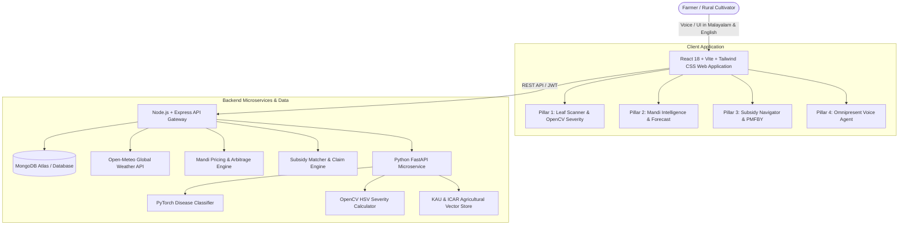

# AgriMitra 360: An End-to-End Multimodal AI Platform for Precision Agronomy, Dynamic Market Intelligence, and Autonomous Subsidy Navigation


---

## 📌 Project Abstract

Agriculture remains the backbone of the economy, yet smallholder farmers face severe systemic bottlenecks across the entire farming lifecycle: delayed crop disease diagnosis, exploitation by middlemen due to lack of transparent market intelligence, and near-zero accessibility to crucial government subsidies and crop insurance schemes. Existing digital solutions operate in silos—offering isolated tools that demand high digital literacy and fluency in English, alienating the majority of rural cultivators.

To bridge this critical divide, **AgriMitra 360** introduces an integrated, voice-first, multimodal AI ecosystem tailored for the complete agricultural journey. The platform converges three foundational pillars powered by modern Artificial Intelligence:

1. **Pre-Harvest Agronomy & Disease Diagnostics**: Utilizing Computer Vision (PyTorch & OpenCV) and Multimodal AI, farmers capture real-time images of affected crop foliage. The system instantly detects pathogen strains, quantifies infestation severity percentage via HSV color segmentation, and recommends localized organic and chemical remediation from Kerala Agricultural University (KAU) / ICAR, reinforced by real-time meteorological risk modeling via Open-Meteo.
2. **Post-Harvest Market Intelligence & Mandi Optimization**: Leveraging predictive market modeling and real-time Mandi price feeds (Agmarknet), the dynamic pricing engine calculates net yield valuation, forecasts 7-day price volatility trends, and advises farmers on the most lucrative regional markets to bypass middleman margins.
3. **Autonomous Financial & Subsidy Navigator**: Integrating Retrieval-Augmented Generation (RAG) over state and central agricultural policies (e.g., PMFBY, PM-KISAN, Subhiksha Keralam, Soil Health Cards), the platform automatically maps farm credentials to eligible benefits and provides automated application guidance with digital damage proof.

The cornerstone of the platform is an **Omnipresent Vernacular Voice Agent**, enabling zero-touch speech-to-speech interaction in native regional languages (including **Malayalam** and **English**), breaking all literacy barriers.

**Keywords**: *Multimodal AI, Computer Vision, Precision Agriculture, Gemini 1.5, Mandi Price Prediction, Retrieval-Augmented Generation (RAG), Vernacular Voice Interface, Agricultural Economics.*

---

## 🏛️ The Three Foundational Pillars

```
                     ┌────────────────────────────────────────────────────────┐
                     │              AgriMitra 360 Ecosystem                   │
                     └──────────────────────────┬─────────────────────────────┘
                                                │
         ┌──────────────────────────────────────┼──────────────────────────────────────┐
         │                                      │                                      │
         ▼                                      ▼                                      ▼
┌──────────────────┐                  ┌──────────────────┐                  ┌──────────────────┐
│     PILLAR 1     │                  │     PILLAR 2     │                  │     PILLAR 3     │
│   Pre-Harvest    │                  │   Post-Harvest   │                  │    Financial     │
│    Agronomy      │                  │Market Intelligence│                 │Subsidy Navigator │
├──────────────────┤                  ├──────────────────┤                  ├──────────────────┤
│• Leaf Image Scan │                  │• Agmarknet Live  │                  │• PMFBY Insurance │
│• OpenCV Severity │                  │  Mandi Rates     │                  │  Claim Generator │
│• KAU/ICAR RAG    │                  │• 7-Day Forecast  │                  │• Smart AI Matcher│
│• Weather Spray   │                  │• Middleman Bypass│                  │• Subhiksha &     │
│  Safety Alert    │                  │  Arbitrage Calc  │                  │  Central Schemes │
└──────────────────┘                  └──────────────────┘                  └──────────────────┘
         │                                      │                                      │
         └──────────────────────────────────────┼──────────────────────────────────────┘
                                                │
                                                ▼
                     ┌────────────────────────────────────────────────────────┐
                     │          PILLAR 4: Omnipresent Voice AI Agent          │
                     │  Zero-Touch Malayalam & English Speech-to-Speech       │
                     └────────────────────────────────────────────────────────┘
```

---

## 🤝 Hackathon Stakeholder Impact Matrix

| Stakeholder Group | Addressed by AgriMitra 360 |
|---|---|
| **Farmers & Progressive Farmers** | Zero-touch Malayalam voice interface, instant leaf scan diagnosis, live weather spray alerts. |
| **Farmer Producer Organisations (FPOs) & Coops** | Aggregated Mandi price intelligence and regional market routing to eliminate middleman commission. |
| **Agricultural Officers & Krishi Bhavan Officials** | Automated subsidy eligibility matching and digital crop loss claim packets with verified lesion severity. |
| **Scientists & Extension Specialists (KAU / ICAR)** | Scientific recommendations citing official Package of Practices and biological controls. |
| **Supply Chain & Warehousing** | 7-day predictive price volatility forecast advising whether to HOLD in warehouse or SELL immediately. |
| **NABARD, Rural Banks & Insurance Agencies** | OpenCV objective damage quantification provides transparent digital proof for PMFBY claims and credit. |
| **NGOs & Rural Community Organizations** | Fully inclusive vernacular speech accessibility for non-literate and non-English-speaking cultivators. |

---

## 🏗️ System Architecture



---

## 🛠️ Technology Stack

| Layer | Technology |
|---|---|
| **Frontend** | React 18, Vite, Tailwind CSS, Lucide Icons, Recharts, Web Speech API (Speech Recognition & Synthesis) |
| **Backend Gateway** | Node.js, Express.js, MongoDB / Mongoose, JWT Authentication, Multer |
| **AI Microservice** | Python 3.x, FastAPI, Uvicorn, PyTorch / Torchvision, OpenCV, PIL, NumPy |
| **RAG Knowledge Base** | Curated KAU (Kerala Agricultural University) & ICAR Package of Practices |
| **Market Intelligence** | Agmarknet & APMC Reporting Feeds, Statistical 7-day Volatility Projection |
| **Meteorological API** | Open-Meteo Keyless Global Weather Engine |

---

## 🚀 Quick Start Guide

### Prerequisites
- **Node.js**: v18.x or higher
- **Python**: 3.10 or higher
- **MongoDB**: Local MongoDB or MongoDB Atlas URI

### 1. Install Dependencies

```bash
# Root & client dependencies
npm install
cd client && npm install
cd ../server && npm install
```

### 2. Environment Configuration
Create `server/.env`:
```env
PORT=5000
MONGODB_URI=your_mongodb_connection_string
JWT_SECRET=agrimitra360_secret_key_2026
AI_SERVICE_URL=http://127.0.0.1:8000
```

### 3. Start the Platform
```bash
# Run server & client concurrently from project root
npm run dev

# Or run separately:
# Terminal 1 (Backend Gateway):
cd server && npm run dev

# Terminal 2 (React Frontend):
cd client && npm run dev

# Terminal 3 (Python AI Microservice):
cd ai_service && uvicorn main:app --port 8000 --reload
```

---

## 📱 Live Demonstration Guide for Evaluators

1. **Pillar 1 - Leaf Disease & Weather Diagnosis (`/scan`)**:
   - Upload any tomato/potato/paddy leaf photo.
   - View the deep learning classification score and the **OpenCV Lesion Severity area percentage**.
   - Check the **Weather Spray Safety** rating before applying remedies.
   - If damage > 20%, click **"File PMFBY Claim"** to instantly bridge to Pillar 3.

2. **Pillar 2 - Mandi Price Intelligence & Arbitrage (`/mandi`)**:
   - Select crops like Paddy, Nendran Banana, or Tomato.
   - Observe the **7-Day Price Volatility Forecast** rendered via Recharts.
   - Use the **Middleman Bypass Net-Profit Calculator** by entering harvest quantity (e.g., 600 kg) to view the most profitable market routing.

3. **Pillar 3 - Autonomous Subsidy & Insurance Navigator (`/subsidies`)**:
   - Enter your plot size (e.g., 2 Acres) and crop type.
   - Click **"Evaluate Qualified Schemes"** to see eligible central & Kerala schemes (PM-KISAN, PMFBY, Subhiksha Keralam) and calculate cumulative entitlements.
   - Generate official claim dossiers with geo-tagged damage timestamps.

4. **Pillar 4 - Omnipresent Vernacular Voice AI**:
   - Click the floating **Voice AI** button in the bottom right corner.
   - Tap the microphone and speak in **Malayalam** (e.g., *"ഇന്നത്തെ നെല്ലിന്റെ വില എത്രയാണ്?"*) or click any quick query chip.
   - Listen to the spoken audio response in native Malayalam.

---

## 📄 License & Attribution
Developed for Hackathons and Agricultural Conferences. References authoritative guidelines from the **Kerala Agricultural University (KAU)**, **ICAR**, **Agmarknet**, and the **Ministry of Agriculture & Farmers Welfare, Government of India**.
